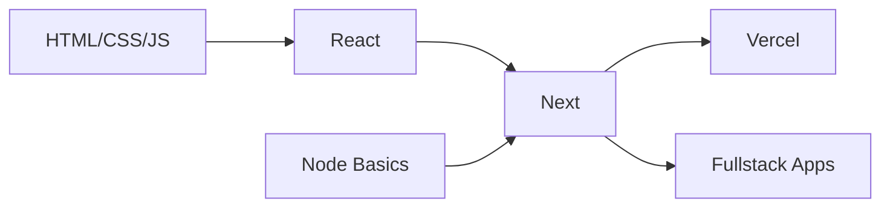

  

## 🚀 Tech Stack & Tools

  
  | Category        | Technologies                                                                 |
  |----------------|------------------------------------------------------------------------------|
  | **Frontend**   |    |
  | **Styling**    |   |
  | **Backend**    |   |
  | **Tools**      |   |

## 🚀 Featured Projects

<table> 
  <tr> 
    <td width="50%"> 
      <h3 align="center">Project 1</h3> 
      
 
         
        
<em>Tech: Next.js, MongoDB, NextAuth</em>
 
        
✨ Feature 1 | ✨ Feature 2 | ✨ Feature 3
 
      
 
    </td>   
    <td width="50%"> 
      <h3 align="center">Project 2</h3> 
      
 
         
        
<em>Tech: React, Tailwind</em>
 
        
✨ Feature 1 | ✨ Feature 2 | ✨ Feature 3
 
      
 
    </td> 
  </tr>   
</table>

## 🎨 My Dev Setup

## 📊 GitHub Analytics
<!--

 
   
   

 -->

  

## 🌟 Let's Connect

 
   
  
  

  
  
 

